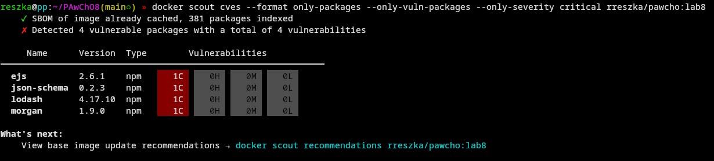
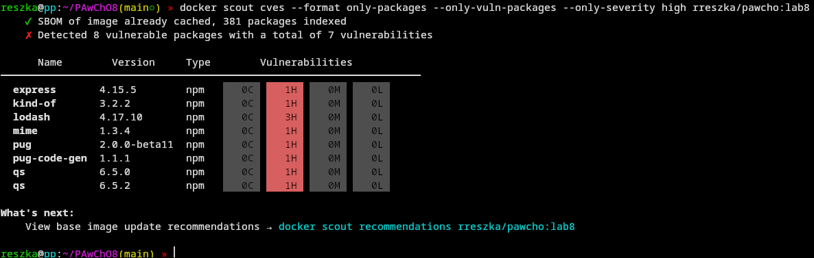
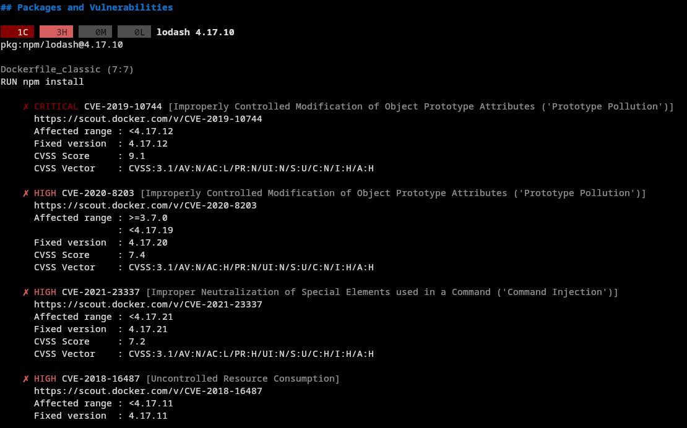
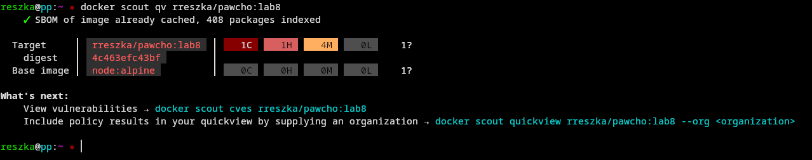
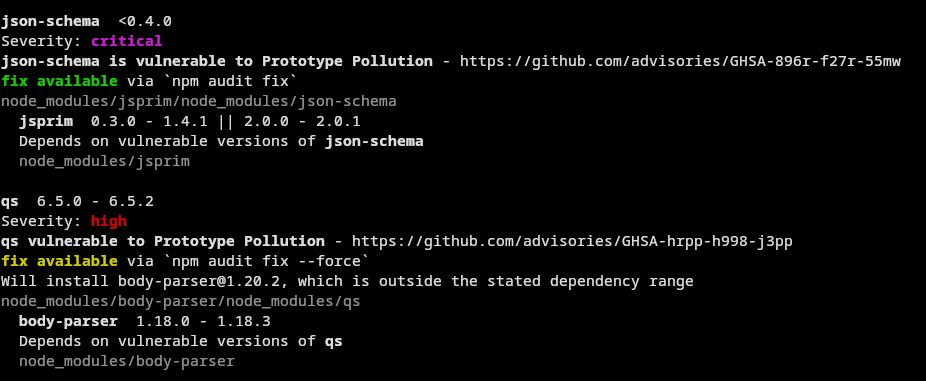
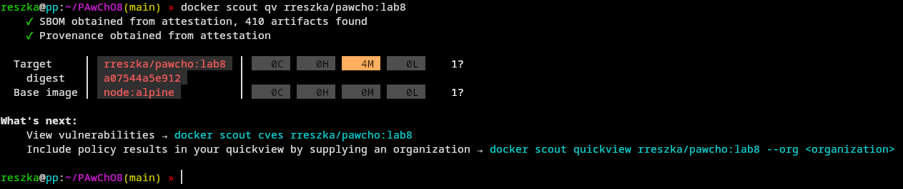

# LAB8 - Docker Scout usage and CVEs analysis

Source of project that has been analyzed is [here](https://github.com/linuxacademy/content-weather-app).

### Building an image

```sh
docker buildx build -f Dockerfile_classic -t rreszka/pawcho:lab8 --sbom=true --provenance=mode=max --push .
```

### Checking image for CVEs

#### Critical severity CVEs



#### High severity CVEs



With usage of command provided below, I could find versions of packages, that are no longer vulnerable:

```sh
docker scout cves --only-severity critical,high rreszka/pawcho:lab8
```

Here is an example:



### Patching the project

To fix this project, package.json has to be updated with safe versions of packages.

[Here](https://github.com/rreszka86/PAwChO8/commit/d3f0337951c23f1136105d4a493771957c0a9114) are differences made to package.json file.

Unfortunately first update of package.json did not cover all vulnerabilities:



Audit provided by npm shows us which packages depend on vulnerable ones:



[Here](https://github.com/rreszka86/PAwChO8/commit/7f5ad2f2c4bc58d1399e2b07e96ac6b991f282e0) are new differences made to package.json file for more patches.

Now we can see that all critical and high severity CVEs have been fixed!


